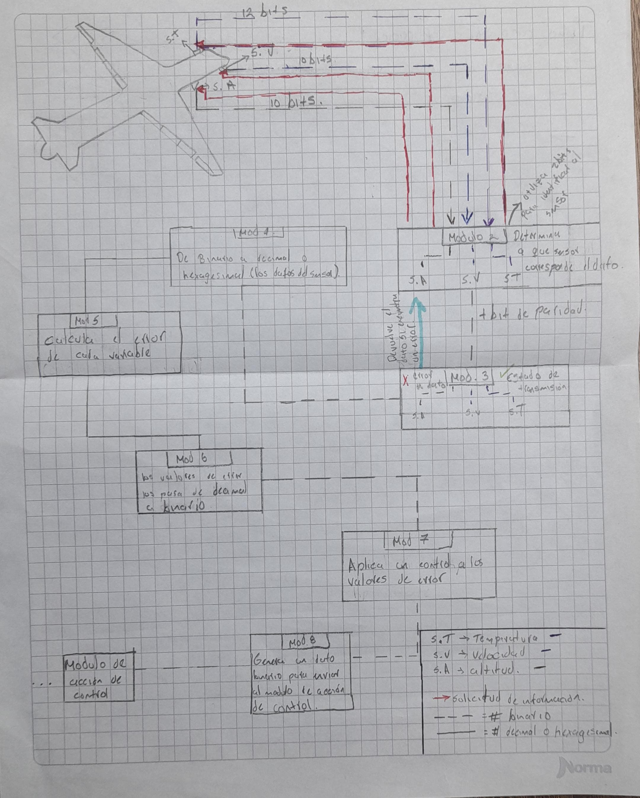
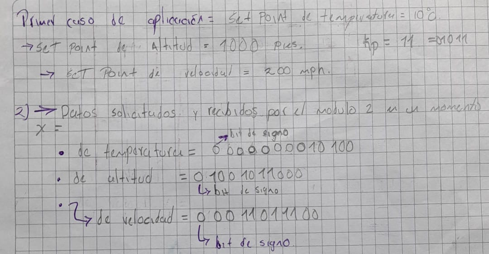
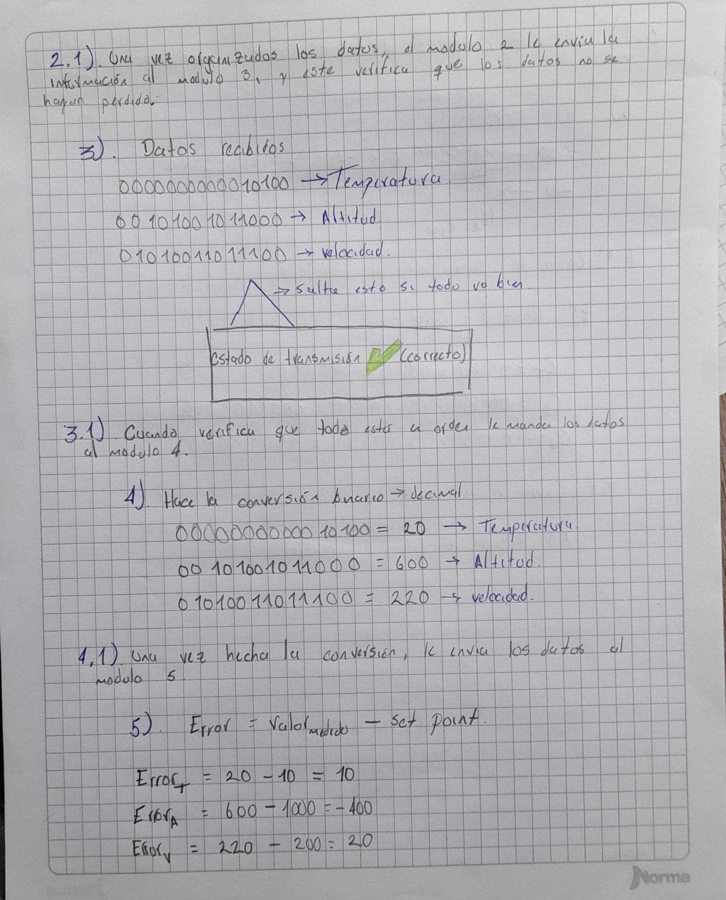
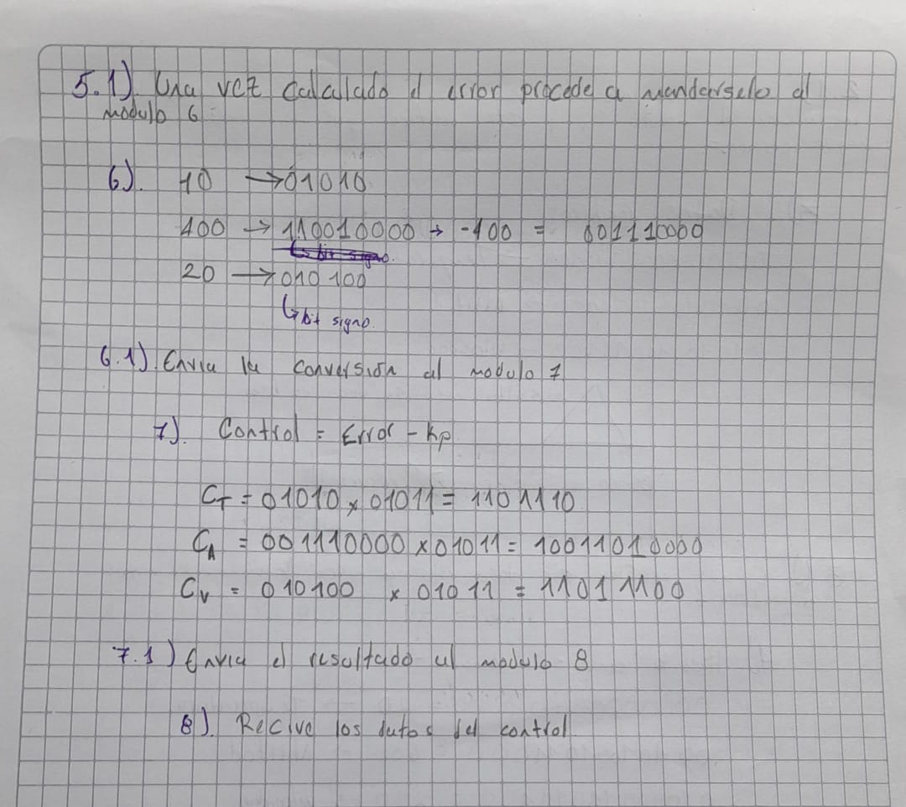
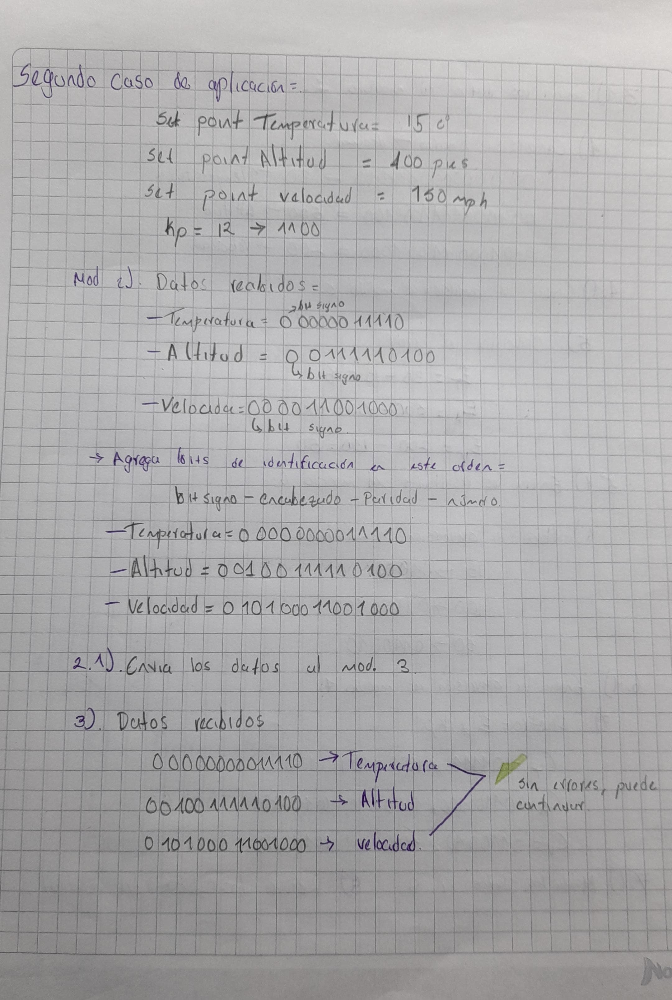
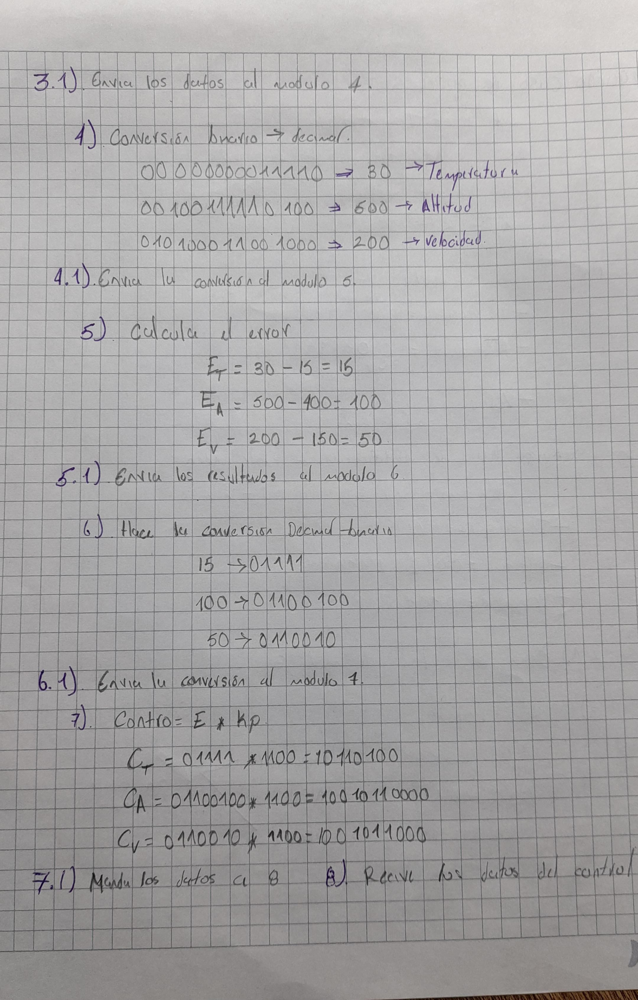
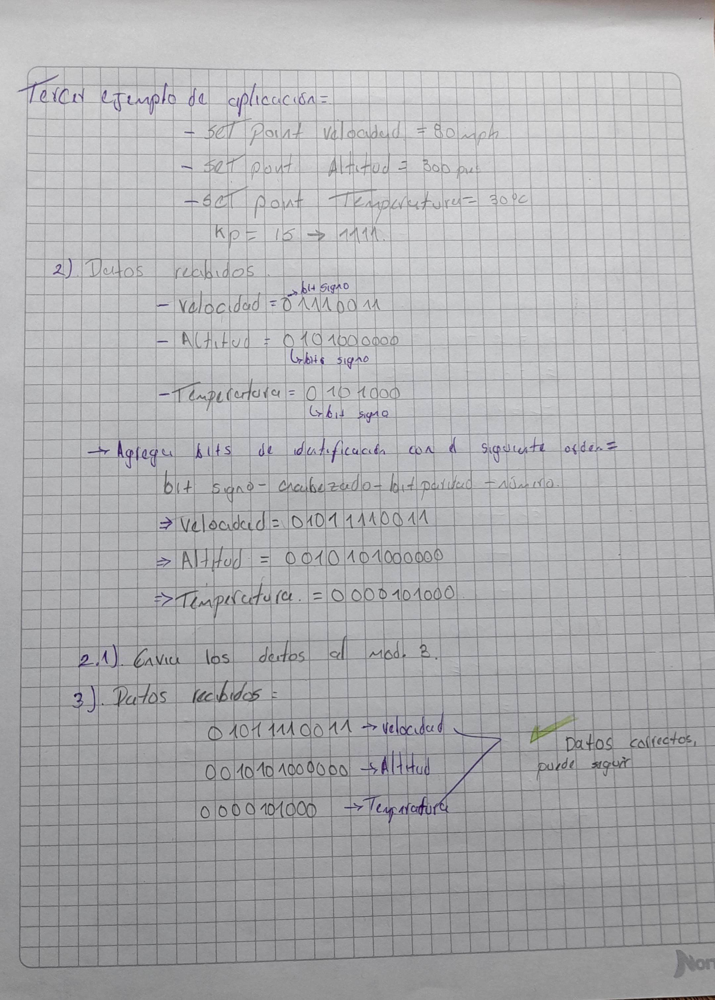
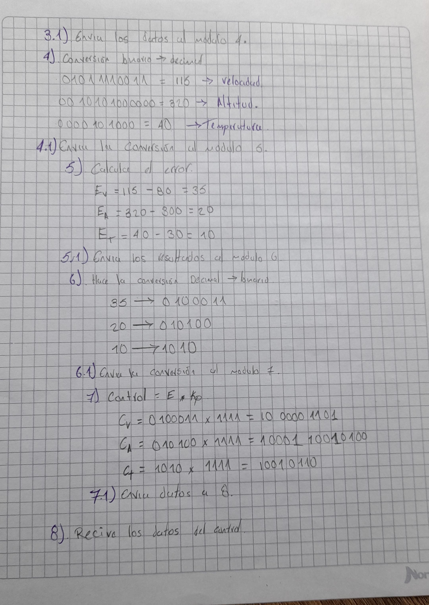

# Sistema de control de variables de una aeronave

### - Diagrama deflujo del sistema

### Desarrollo de los 3 ejemplos:
- Nota: el sistema está diseñado de forma tal que los datos le llegue en binario (incluido el bit de signo) al modulo 2 y que este le agregue los dos bits de encabezado y el bit de paridad que en todos los casos se usara paridad par.
- A continuación encontrará los bits de encabezado que el modulo 2 asignará:
1. Temperatura= 00
2. Altitud= 01
3. velocidad= 10

### Ejemplo #1:

### Ejemplo #2: 

### Ejemplo #3:

# CONCLUSION.
- Con este trabajo tuve la oportunidad de afinzar mi conocimientos sobre los binarios, las operaciones entre ellos y su manejo. Además pude aclarar la diferencia entre diagrama de flujo y de bloques. Tambien pude observar e interactuar con la operacion de este sistema de control de variables. 